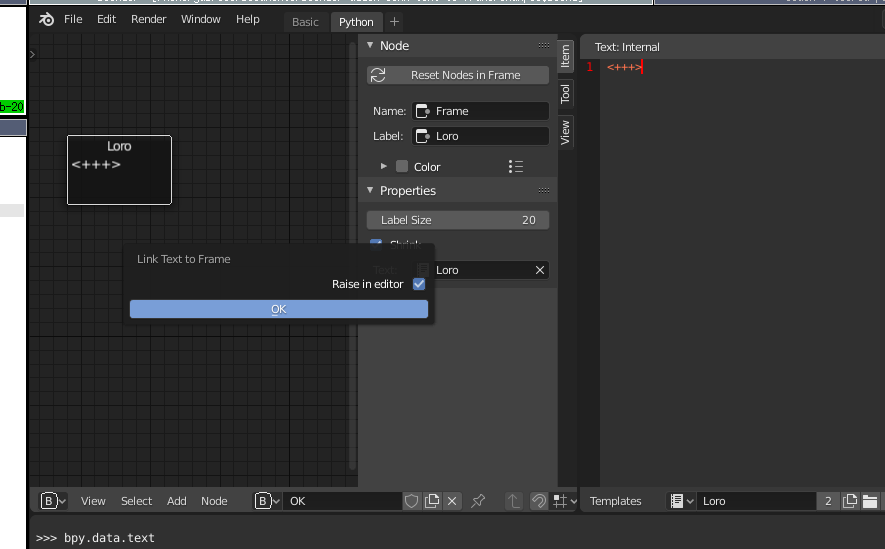

= Link text to node frame

== Create linked text files

Automatically create a linked text file for frame nodes on the node editor.
Frames should have a label set -- these will be used as the name of the new text file.

If _Raise in editor_, the new text file will appear first on all the text editors visible.

== Collate text file routes

If you have a string of linked reroute nodes that are embedded in frames that are linked to text objects, select the first one, and use the 
`Collate all linked texts` to join all the linked text files in the order they were linked in.

You can optionally save the file to the file system.
Also, you can provide a command (with a context "current working directory") to be run after collation.

== Edit prev / next text on the linked frames

When you are editing a text that's linked by frames and reroutes you run the `node.edit_next_text` and `node.edit_prev_text` texts to switch to the next linked text.
It will, by default, stub missing texts.

TIP: Link these to Ctrl ] and Ctrl [ on your key mappings.
